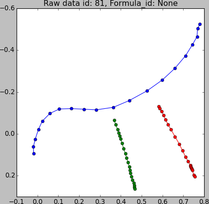
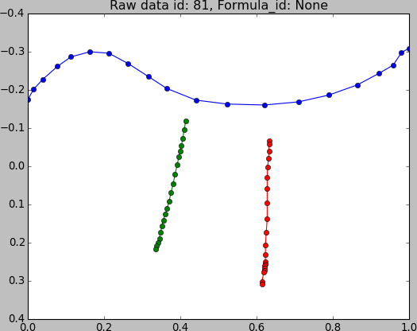
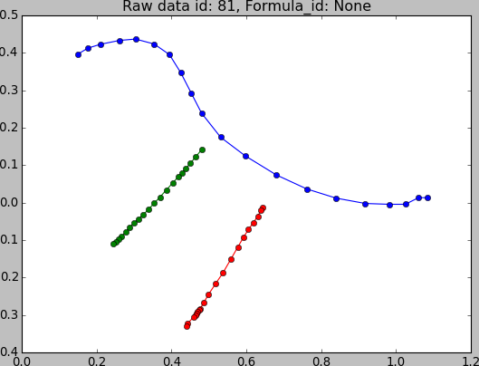

Data Multiplication
================================

The automatic data multiplication works like this:

.. code-block:: python

    for algorithm in multiplication_queue:
        new_training_set = []
        for recording in training_set:
            samples = algorithm(recording)
            for sample in samples:
                new_training_set.append(sample)
        training_set = new_training_set
    return new_training_set

.. warning::

    The create_pfile procedure replaces the current set of recordings by the
    set returned by the data multiplication steps.

.. automodule:: hwrt.data_multiplication
   :members:

