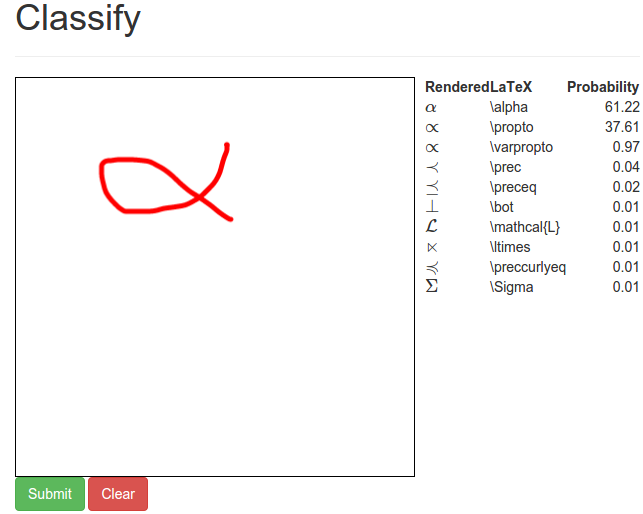

Installation
============

The ``hwrt`` toolkit can be installed via pip:

.. code:: bash

    # pip install hwrt

However, you might have to install some packages first for ``scipy``.

Debian-based systems
~~~~~~~~~~~~~~~~~~~~
Debian-based systems are Ubuntu, Linux Mint, and of course Debian. If you have
such a Linux system, then the following commands will help you to install the
``hwrt`` package.

For ``scipy``, ``numpy`` and ``matplotlib`` you might need these packages:

.. code:: bash

    # apt-get install python-pip libblas-dev liblapack-dev gfortran
    # apt-get install python-scipy python-numpy
    # apt-get install libfreetype6-dev
    # apt-get install libgeos-dev
    # apt-get install libhdf5-dev

If you want to use MySQL functionality, you will need

.. code:: bash

    # apt-get install libmysqlclient-dev

If you want to use bitmap features, you have to install `pillow`_. This might
include installing the following:

.. code:: bash

    # apt-get install python-dev python-setuptools
    # apt-get install python3-dev python3-setuptools
    # apt-get install libtiff4-dev libjpeg8-dev zlib1g-dev libfreetype6-dev liblcms1-dev libwebp-dev

Python packages
~~~~~~~~~~~~~~~

.. code:: bash

    # pip install numpy
    # pip install scipy
    # pip install future
    # pip install pymysql
    # pip install PILLOW
    # pip install natsort matplotlib coveralls

Now you can install `pfile_utils`_. Some explanation of what they
are can be found at `my blog`_

As a last step, you can install hwrt:

.. code:: bash

    # pip install hwrt

Test installation
~~~~~~~~~~~~~~~~~

You can check if it worked by

.. code:: bash

    $ hwrt --version
    hwrt 0.1.190

Please send me an email (info@martin-thoma.de) if that didn't work.

First steps as a developer
--------------------------

First of all, you should download the raw data. This is done by executing
``download.py``.

Next, you can view a simple example by ``view.py``. For example, with
``view.py --list`` you can view all raw data IDs of your current data.
With ``view.py -i 291075`` you can see how the preprocessing steps and the
later data multiplication steps influence the recording. If you didn't execute
view from a model folder and if you didn't specify another model with ``-m``,
you will get the output of the small baseline model that was created in your
projects root folder (``~/hwr-experiments`` per default, but you can modify that
with ``~/.hwrtrc``). That will show 3 rotated images of :math:`\pi`.

If you want to see more examples, have a look at
https://github.com/MartinThoma/hwr-experiments

First steps as a user
---------------------

The command

.. code:: bash

    $ hwrt serve

will start a web server. Go to http://127.0.0.1:5000/interactive to see

nntoolkit
---------

In order to use `hwrt` completely (especially testing, training and record.py)
you have to have an executable ``nntoolkit`` that supports the following usages:

.. code:: bash

    $ nntoolkit run --batch-size 1 -f%0.4f <test_file> < <model>

has to output the evaluation result in standard output as a list of floats
separated by newlines ``\n+``. The evaluation result might either be the
index of the neuron with highest activation or the list of probabilities
of each class separated by spaces.

.. code:: bash

    $ nntoolkit make mlp <topology>

has to print the model in standard output.

The `hwrt` toolset is independent of the way the training command is
formatted as the training command gets inserted directly into the configuration
file ``info.yml`` of the model.

In order to implement such a neural network executable one can use Theano,
cuDNN_ or Caffe_. Deeplearning_ contains example code for multilayer perceptrons
written with Theano (Python).

Upgrading hwrt
--------------

Upgrading hwrt to the latest version is much easier:

.. code:: bash

    # pip install hwrt --upgrade

.. _`pfile_utils`: http://www1.icsi.berkeley.edu/~dpwe/projects/sprach/sprachcore.html
.. _my blog: http://martin-thoma.com/what-are-pfiles/
.. _Python: http://www.python.org/
.. _Caffe: http://caffe.berkeleyvision.org/
.. _cuDNN: https://developer.nvidia.com/cuDNN
.. _Deeplearning: http://www.deeplearning.net/tutorial/
.. _pillow: http://python-pillow.github.io/